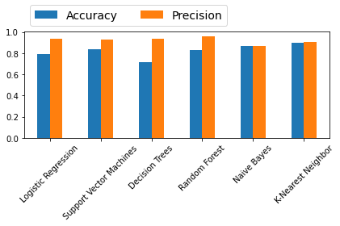
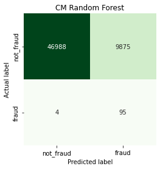
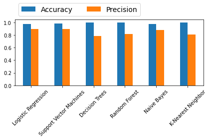
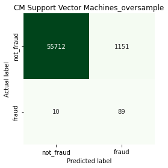

# Fraud Detection By Machine Learning and Deep Learning

This project aims to classify the fraud and healthy transactions in the provided dataset by kaggle.

### Road Map
-Data Preprocessing and cleaning for the machine learning models.

-Machine Learning Models with SKlearn

-Deep Learning Models with TensorFlow

-SemiSupervised Models with AutoEncoder

-Unsupervised methods, Anomaly Detection.

-Compare the results

# Scaled Data or Original Data?
Let's see whether the scaled dataset works better for the machine learning models or the original one. 
           

The left confusion matrix represents the original dataset, and the right one is for the scaled dataset. As we can see, the results for the scaled dataset has fewer false negative. Then, we use the scaled dataset for the rest of the project.

## Labels distribution

The data for the targets are not balanced. 284315 for no fraud transactions and 492 for fraud. To use the supervised method, we must apply undersampling or oversampling techniques to the dataset.

# Machine Learning Results on Undersampled dataset:
After applying the undersampling method to the dataset and implementing several machine learning algorithms, we found these results on the original test dataset.

 

	                Accuracy Precision
  
Logistic Regression ===>	    80%,	  94%

Support Vector Machines	===>  84%,	  93%

Decision Trees	===>          71%,	  94%

Random Forest	===>            83%,	  96%

Naive Bayes	===>              87%,	  87%

K-Nearest Neighbor	===>      90%,	   91%

### The best model for the undersampled dataset is Random Forest. Let's Visualise the confusion matrix for the model.

 

# Machine Learning Results on Oversampled dataset:
After applying the Oversampling method to the dataset and implementing several machine learning algorithms, we found these results on the original test dataset.

 

	                Accuracy Precision
  
Logistic Regression ===>	    97%,	  90%

Support Vector Machines	===>  98%,	  90%

Decision Trees	===>          99%,	  79%

Random Forest	===>            99%,	  82%

Naive Bayes	===>              97%,	  88%

K-Nearest Neighbor	===>      99%,	   81%

### The best model for the Oversampled dataset is Support Vector Machines. Let's Visualise the confusion matrix for the model.

 

