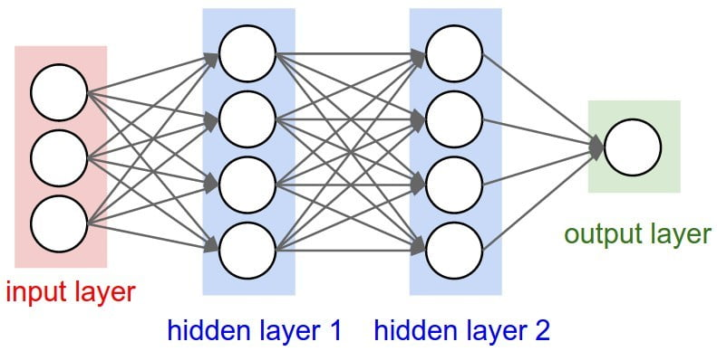

# Fraud Detection By Machine Learning and Deep Learning

This project aims to classify the fraud and healthy transactions in the provided dataset by kaggle.

### Road Map

-Data Visualization

-Data Preprocessing and cleaning for the machine learning models.

-Machine Learning Models with SKlearn

-Deep Learning Models with TensorFlow

-SemiSupervised Models with AutoEncoder

-Unsupervised methods, Anomaly Detection.

-Compare the results

# Data Visualization

### Distribution of each feature

 

### Labels Distribution for fraud and non-fraud transactions.

### Amount Distribution of transactions

### Time Distribution of Transactions 

# Scaled Data or Original Data?
Let's see whether the scaled dataset works better for the machine learning models or the original one. 
           

The left confusion matrix represents the original dataset, and the right one is for the scaled dataset. As we can see, the results for the scaled dataset has fewer false negative. Then, we use the scaled dataset for the rest of the project.

## Labels distribution

The data for the targets are not balanced. 284315 for no fraud transactions and 492 for fraud. To use the supervised method, we must apply undersampling or oversampling techniques to the dataset.

# Machine Learning Results on Undersampled dataset:
After applying the undersampling method to the dataset and implementing several machine learning algorithms, we found these results on the original test dataset.

 

	                Accuracy Precision
  
Logistic Regression ===>	    80%,	  94%

Support Vector Machines	===>  84%,	  93%

Decision Trees	===>          71%,	  94%

Random Forest	===>            83%,	  96%

Naive Bayes	===>              87%,	  87%

K-Nearest Neighbor	===>      90%,	   91%

### The best model for the undersampled dataset is Random Forest. Let's Visualise the confusion matrix for the model.

 

# Machine Learning Results on Oversampled dataset:
After applying the Oversampling method to the dataset and implementing several machine learning algorithms, we found these results on the original test dataset.

 

	                Accuracy Precision
  
Logistic Regression ===>	    97%,	  90%

Support Vector Machines	===>  98%,	  90%

Decision Trees	===>          99%,	  79%

Random Forest	===>            99%,	  82%

Naive Bayes	===>              97%,	  88%

K-Nearest Neighbor	===>      99%,	   81%

### The best model for the Oversampled dataset is Support Vector Machines. Let's Visualise the confusion matrix for the model.

 

# Deep Learning Model, Deep Neural Network(DNN)

In the context of Machine Learning, it has been determined that the best performance on the original dataset can be achieved using a scaled and oversampled dataset. The aim of this report is to implement deep learning models using this optimized dataset.

### Deep Neural Network

A Deep Neural Network (DNN) is a machine learning model that is inspired by the structure and function of the human brain, consisting of multiple interconnected layers (known as hidden layers) that process and transmit information to make predictions or classifications. It is a type of artificial neural network that utilizes many layers to learn complex relationships between inputs and outputs.

 

### The following method will be used to achieve this goal:

1- Apply a Learning Rate Scheduler callback in TensorFlow to find the optimal learning rate for the model.

2- Implement early stopping and model checkpoint callbacks to prevent overfitting and save the model with the lowest loss respectively.

3- Train the model on both the train and validation data.

4- Evaluate the model on the original dataset and present the results by plotting a confusion matrix.

By following this method, we hope to achieve a deep learning model with improved performance on the original dataset.

Based on the graph, learning rate Vs.  validation accuracy, we can conclude that the best learning rate is around 0.00007. 

Let's see the results for DNN.

# SemiSupervised Method: **AutoEncoder**

An Autoencoder is a type of artificial neural network used for unsupervised learning that aims to reconstruct its input data through encoding it into a lower-dimensional representation (encoding), and then decoding it back to its original form (decoding). It can also be used for dimensionality reduction and anomaly detection which is the main topic of our project.

 

### Method: 
In the following steps, the AutoEncoder model is fit to an oversampled and scaled dataset. The model is then used to make predictions on the scaled dataset, resulting in a new set of predicted data. Finally, the most accurate Deep Learning model is utilized to identify fraud transactions on the original test data.

     

The left image depicts the prediction process on the scaled test data directly following the utilization of the autoencoder. On the other hand, the right image represents the application of the autoencoder on the oversampled train and test data, followed by training a simple DNN model, and finally evaluating and making predictions on the scaled dataset. It can be concluded that the autoencoder exhibits effective performance.

# Unsupervised Method: **IsolationForest**

In the final section, we utilized an unsupervised learning algorithm to detect fraud in the data without utilizing labels. The method employed is based on Anomaly Detection, a common technique in fraud detection projects using machine learning to detect patterns in the data that deviate from the normal behavior. 
### Isolation Forest
Isolation Forest is an unsupervised machine learning algorithm for detecting anomalies or outliers in a dataset by isolating individual observations and comparing their structure to the structure of the entire dataset.

 

### Confusion Matrix for Isolation Forest

 

The results are positive, with 88 out of 99 fraud transactions being accurately predicted and over 94% of normal transactions being correctly predicted.

# Summary 

In the project, various methods were used to detect fraud in a credit card dataset from Kaggle. 

### Supervised Learning 

For supervised learning methods, we have to balance the datasets. To do this, we used undersampling and oversampling methods on the scaled datasets. 
For the undersample data, the RandomForest model has the best performance, but for the oversample data, the Support Vector Machine works better. 

### SemiSupervised Learning

For semisupervised learning methods, we employed the Autoencoder model to generate new sets of data and apply the Machine learning model to them.

### Unsupervised Learning

For unsupervised learning methods, we used the IsolationForest model and found interesting results.

### Deep Learning

In the deep learning section, we used the DNN model to find the fraud in the transactions.

